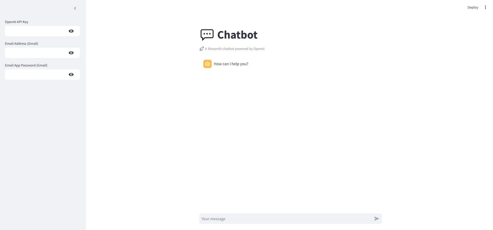
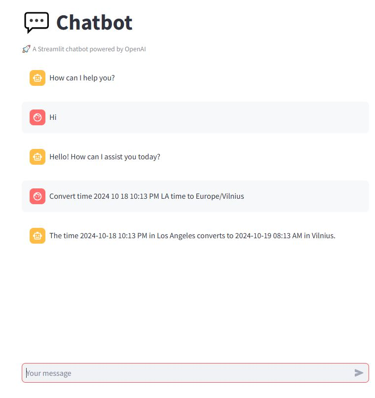
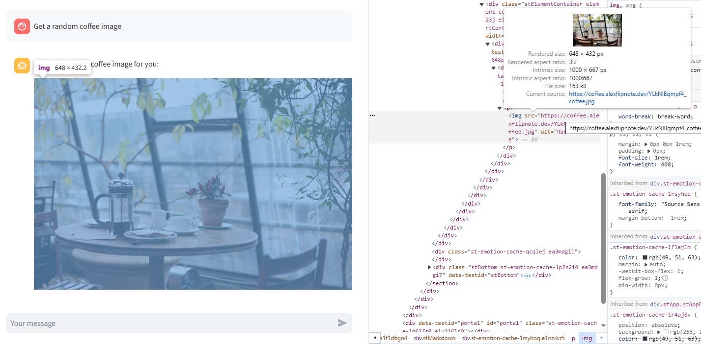
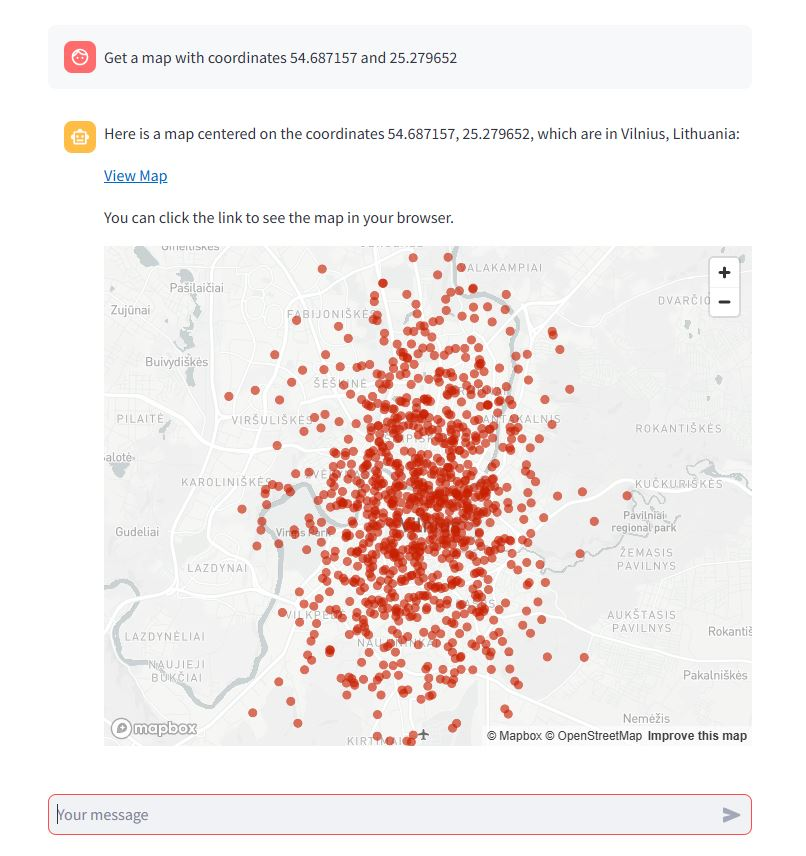
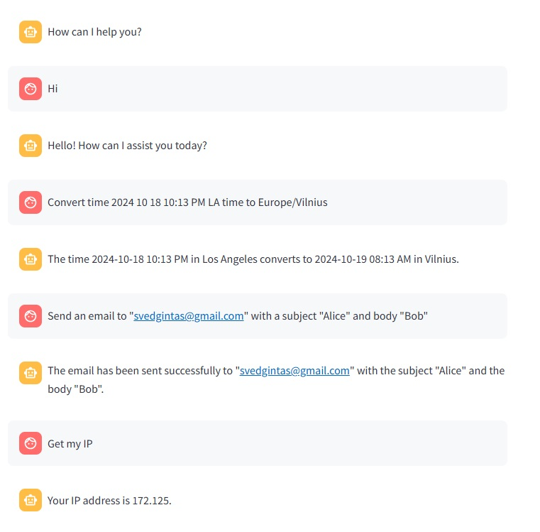
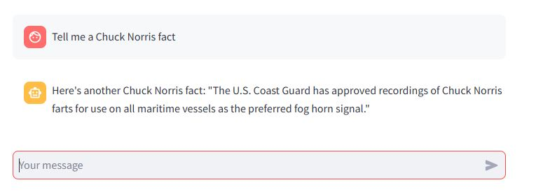

<div align="center">
  <h1>Swiss Knife Chatbot</h1>
  <br />
  <br />
</div>

<details open="open">
<summary>Table of Contents</summary>

- [About](#about)
  - [How does it work](#how-does-it-work)
  - [Built With](#built-with)
- [Features](#features)
- [Usage](#usage)
- [Functions](#functions)
- [Screenshots](#screenshots)
- [License](#license)

</details>

---

## About

<table>
<tr>
<td>

This project is an interactive LLM chatbot developed using Python and Streamlit. The chatbot provides various utility functions such as converting time between time zones, sending emails, retrieving your IP address, getting maps of locations, fetching coffee images, and sharing random Chuck Norris facts.

It also has capability of drawining interactive maps.

The application utilizes APIs to retrieve data and respond interactively. It's designed with user engagement and functionality in mind, and it offers a dynamic interface where users can input commands and receive responses in real-time.

It was built as a demonstration of how AI chatbots can be integrated with APIs to perform real-world tasks efficiently. 

</td>
</tr>
</table>

### How does it work

This chatbot processes user input and connects to various APIs to fulfill specific tasks. Here's a step-by-step explanation of how it operates:

1. **User Input**: The chatbot takes user inputs via a Streamlit web interface. It interprets commands like "Convert time", "Send email", "Get my IP", etc.

2. **API Integration**: Depending on the command, the application calls the relevant API:
   - **Time Conversion**: Converts time zones using a time API.
   - **Email**: Sends emails via a configured SMTP service.
   - **IP Retrieval**: Fetches the user's IP using a public IP API.
   - **Map Retrieval**: Displays maps using a mapping API (e.g., Google Maps API).
   - **Coffee Image**: Fetches a random coffee image from a coffee-related API.
   - **Chuck Norris Fact**: Retrieves a random Chuck Norris fact from an API.

3. **Response Handling**: The chatbot processes the API responses and displays the information back to the user on the Streamlit interface. Errors are handled gracefully, displaying messages to the user if an issue occurs.

4. **Completion**: The application runs as a continuous Streamlit app, always ready to accept new commands.

5. **Images**: Chatbot allows rendering images from the Coffee Image API.

6. **Maps**: You can even render maps with some sample points.

### Built With

- Python
- Streamlit
- APIs (for various functions such as time conversion, IP retrieval, and more)
- SMTP (for email functionality)
- Logging modules for error tracking and debugging
- ChatGPT 4o 

## Features

<ul>
  <li>Interactive chatbot interface built with Streamlit.</li>
  <li>Handles time conversions between different time zones.</li>
  <li>Sends emails directly through the app.</li>
  <li>Retrieves your IP address and displays it.</li>
  <li>Displays maps of specified locations.</li>
  <li>Fetches random coffee images to brighten your day.</li>
  <li>Provides random Chuck Norris facts for entertainment.</li>
  <li>Graceful error handling and informative logs for troubleshooting.</li>
</ul>

### Usage

#### Setup

1. Have Python installed along with Streamlit.
2. Clone the repository.
3. Install the required packages:
    ```shell
    pip install -r requirements.txt
    ```

#### Running the App

1. Open a terminal and navigate to the project directory.
2. Run the Streamlit app:
    ```shell
    streamlit run app.py
    ```
3. The chatbot interface will open in your browser.

## Functions

These are the custom functions that can be actived in the chat, by writing a text in the "text to activate it" column.

| Function Description                          | Text to Activate It          |
|-----------------------------------------------|------------------------------|
| Convert time between different time zones     | Convert time 2024 10 18 10:13 PM LA time to Europe/Vilnius               |
| Send an email                                 | Send an email to "test@gmail.com" with a subject "Alice" and body "Bob"                |
| Retrieve and display your IP address          | Get my ip                |
| Display a map of a specified location         | Get a map with coordinates 54.687157 and 25.279652                  |
| Fetch a random coffee image                   | Get a random coffee image          |
| Provide a random Chuck Norris fact            | Tell me a Chuck Norris fact |

## Screenshots

<br>
Chatbot interface

<br>
Converting the time from one timezone to another.

<br>
Fetching a coffee image.

<br>
Fetching a map with a custom coordinates.

<br>
Geting my IP.

<br>
Sending an email.

<br>
Fetching a random coffee image.

[](https://youtu.be/d3z1Ugrlk98)<br>
Watch the video demo.

## License

This project is licensed under the **MIT license**. You are free to edit and distribute this template as you wish.

See [LICENSE](LICENSE) for more information.